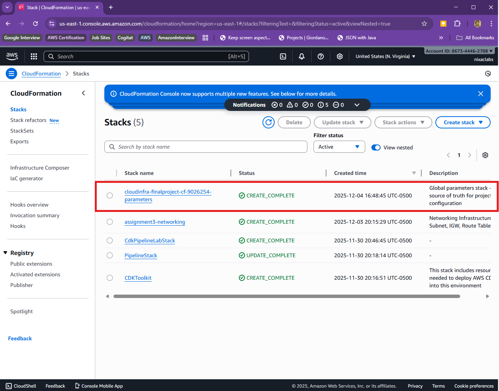
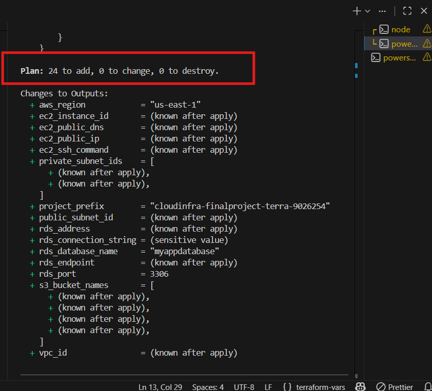
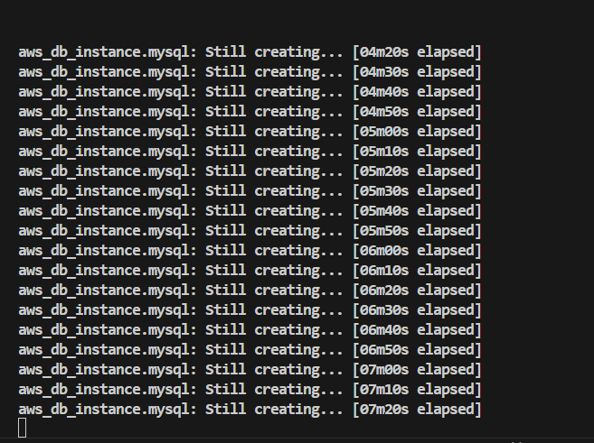
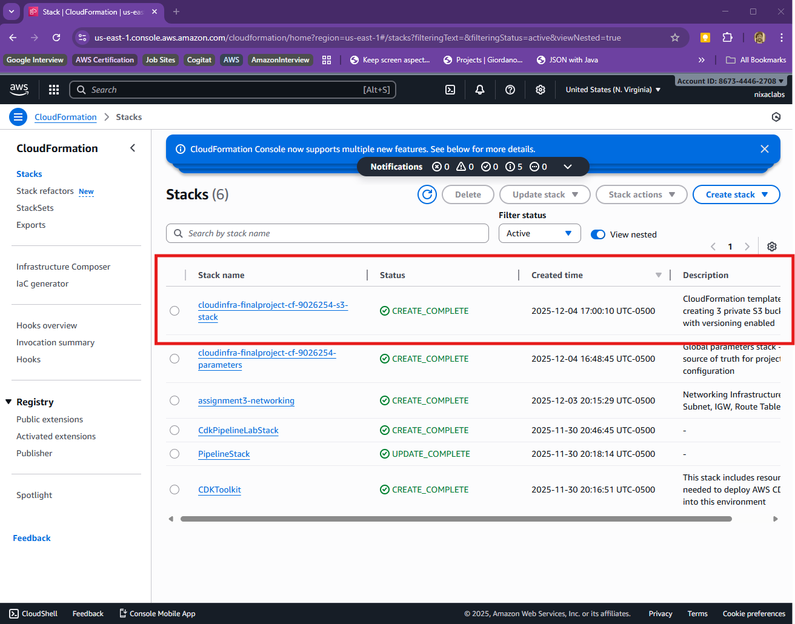
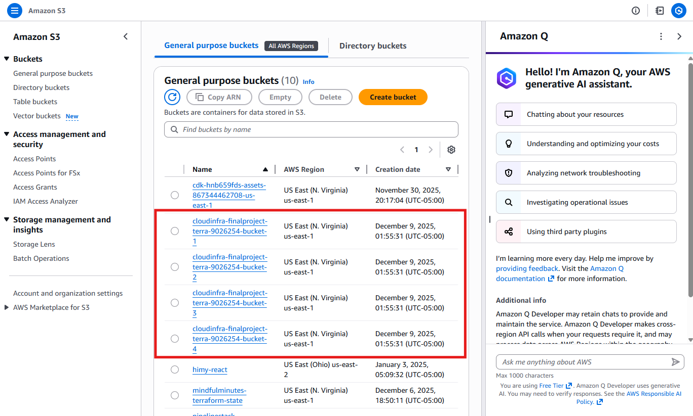
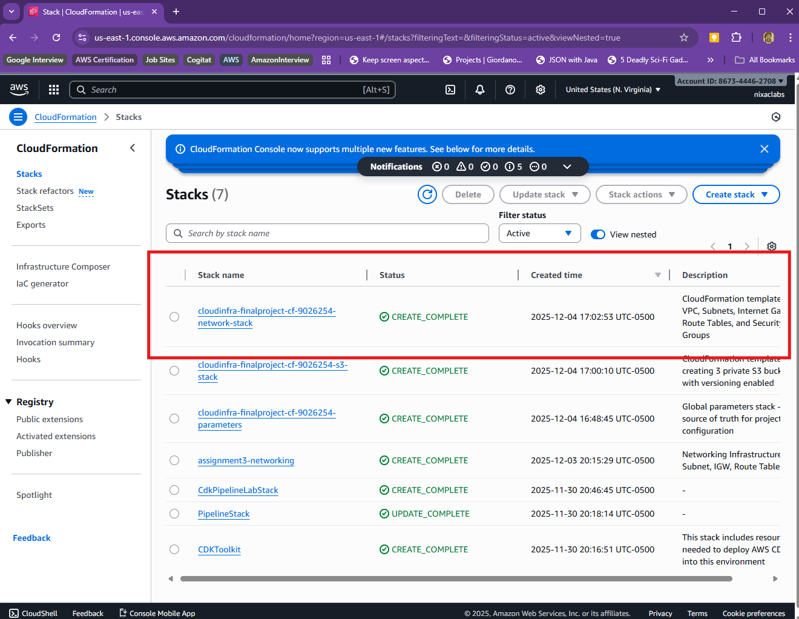
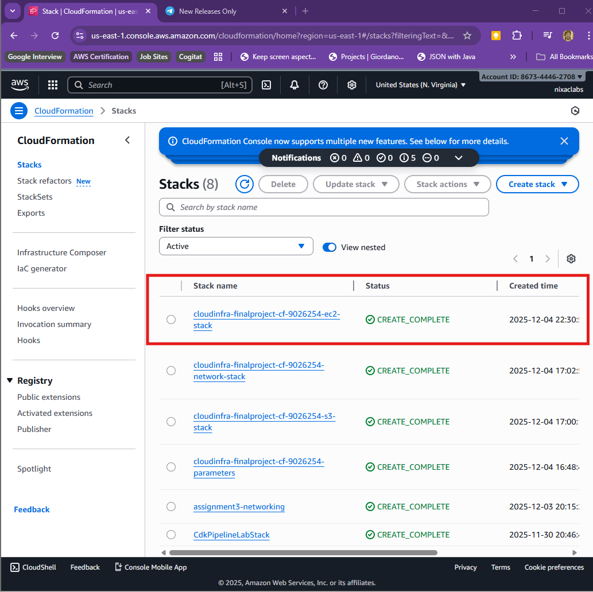
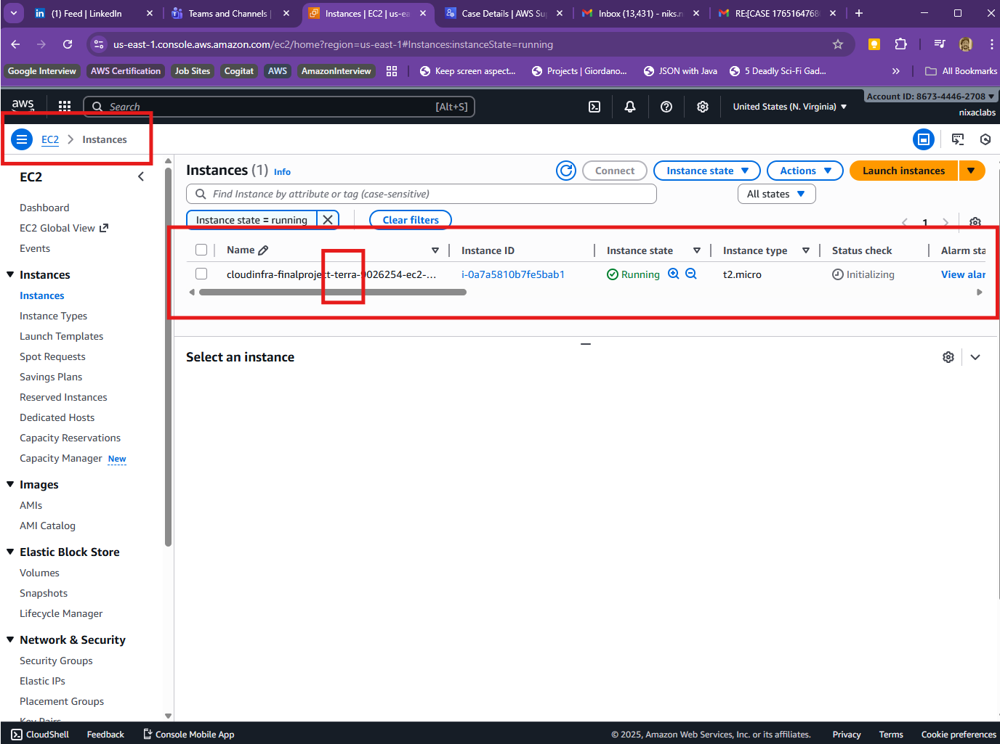
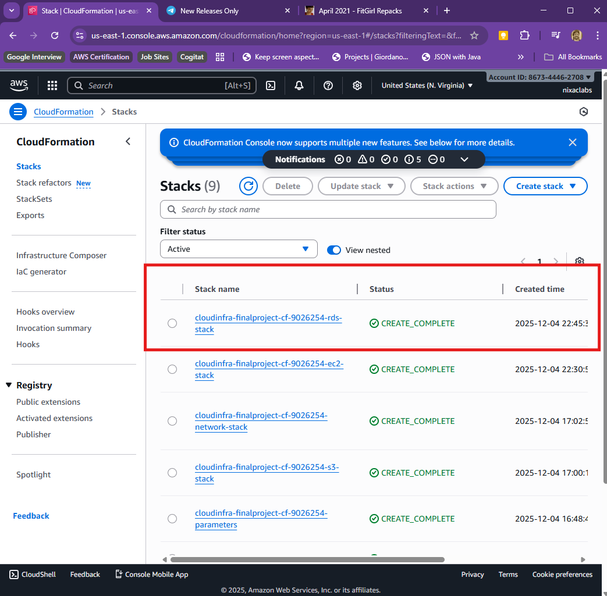
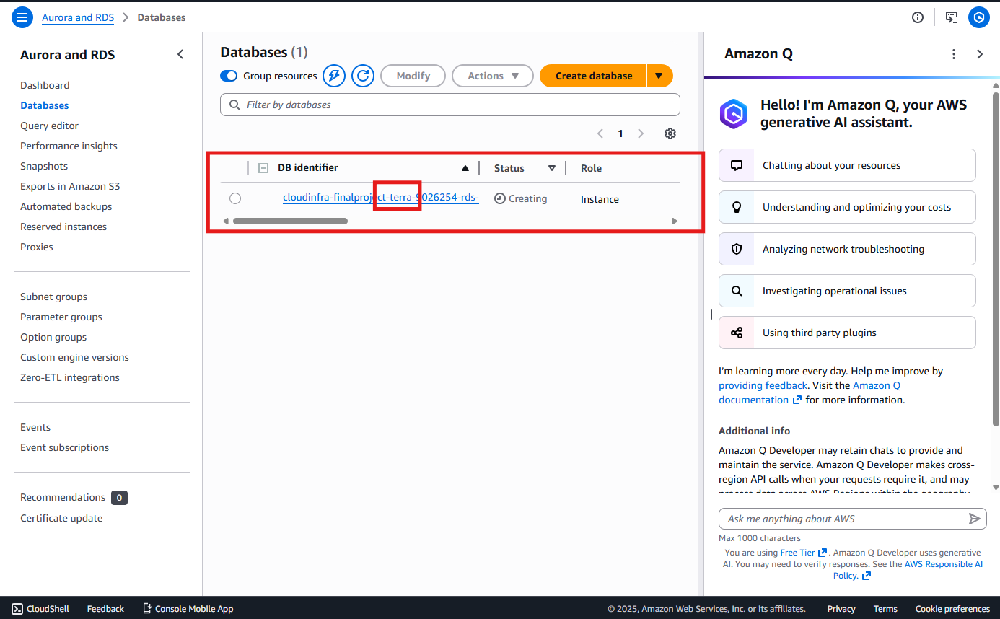

#  PROG 8870 - Cloud Architectures and Infrastructure as Code
## Deploying AWS Infrastructure with Terraform and CloudFormation 

### **Project Report**
**Prepared by** : Nikhil Shankar Chirakkal Sivasankaran
**Student ID:** 9026254 

---

## Overview

Deployed identical AWS infrastructure using CloudFormation and Terraform:
- **CloudFormation:** `cloudinfra-finalproject-cf-9026254-` (VPC: 10.0.0.0/16)
- **Terraform:** `cloudinfra-finalproject-terra-9026254-` (VPC: 10.1.0.0/16)

**Resources:** S3 buckets, VPC + subnets, EC2 instance, RDS MySQL database

---

## Architecture


**Network Layout:**
- 1 Public subnet (EC2)
- 2 Private subnets in different AZs (RDS)
- Internet Gateway for public access
- Security groups for EC2 (SSH) and RDS (MySQL)

---

## Code Structure

### CloudFormation

```
cloudformation/
├── parameters.yaml      # Global config (single source of truth)
├── s3-buckets.yaml     # Storage
├── network.yaml        # VPC/subnets
├── ec2-instance.yaml   # Compute
└── rds-instance.yaml   # Database
```

**Key Feature: Cross-Stack References**
```yaml
# parameters.yaml exports prefix
Outputs:
  ProjectPrefix:
    Export:
      Name: 'GlobalProjectPrefix'

# Other stacks import it
Parameters:
  ProjectPrefix:
    Default: !ImportValue GlobalProjectPrefix
```


---

### Terraform

```
terraform/
├── variables.tf    # Variable definitions
├── terraform.tfvars # Values (not in Git)
├── s3.tf           # Storage
├── vpc.tf          # VPC/subnets
├── ec2.tf          # Compute
├── rds.tf          # Database
└── outputs.tf      # Connection details
```

**Key Feature: Dynamic AMI**
```hcl
data "aws_ami" "amazon_linux_2" {
  most_recent = true
  owners      = ["amazon"]
  filter {
    name   = "name"
    values = ["amzn2-ami-hvm-*-x86_64-gp2"]
  }
}
```



---

## Modularity & Best Practices

### CloudFormation
- **5 separate stacks:** Parameters → S3 → Network → EC2 → RDS
- **Exports/Imports:** Stack outputs used by other stacks
- **Benefits:** Update one stack independently, clear dependencies

### Terraform
- **File separation:** Each service in separate `.tf` file
- **Centralized variables:** Single source in `variables.tf`
- **Benefits:** Easy to find/modify, single deployment command

### Both
✅ Consistent naming with configurable prefix
✅ No hardcoded values
✅ Security: RDS in private subnets, S3 public access blocked
✅ Sensitive data excluded from Git

---

## Deployed Resources

### S3 Buckets
**CloudFormation:** 3 buckets | **Terraform:** 4 buckets
- Versioning enabled
- Public access blocked







---

### VPC & Networking
- VPC with Internet Gateway
- Public subnet for EC2
- 2 private subnets (different AZs) for RDS




---

### EC2 Instance
- Type: t2.micro (Free Tier)
- AMI: Amazon Linux 2
- Public subnet with public IP
- SSH access (port 22)





---

### RDS Database
- Engine: MySQL 8.0
- Instance: db.t3.micro (Free Tier)
- Private subnets only (not publicly accessible)






---

## Deployment

**CloudFormation (Sequential):**
```bash
aws cloudformation create-stack --stack-name ...-params-stack --template-body file://parameters.yaml
aws cloudformation create-stack --stack-name ...-s3-stack --template-body file://s3-buckets.yaml
aws cloudformation create-stack --stack-name ...-network-stack --template-body file://network.yaml
aws cloudformation create-stack --stack-name ...-ec2-stack --template-body file://ec2-instance.yaml
aws cloudformation create-stack --stack-name ...-rds-stack --template-body file://rds-instance.yaml
```

**Terraform (Single Command):**
```bash
terraform init
terraform plan
terraform apply
```

---

## Challenges & Solutions

| Challenge | Solution |
|-----------|----------|
| Stack dependency order | Created parameters stack first, used Exports/Imports |
| RDS needs 2+ AZs | Created 2 private subnets in different AZs |
| Key pair must pre-exist | Created in AWS Console before deployment |
| Sensitive data security | Used .gitignore for tfvars, NoEcho for CloudFormation |

---

## Key Learnings

**Technical:**
- IaC modularity patterns
- AWS service dependencies
- State management (CloudFormation: AWS-managed, Terraform: local file)

**Best Practices:**
- Separate concerns (one service per file/stack)
- Centralized configuration
- Security-first design
- Version control with sensitive data protection

**Tool Comparison:**
- **CloudFormation:** AWS-native, auto state management, sequential stacks
- **Terraform:** Multi-cloud, HCL syntax, single deployment

---

## Conclusion

Successfully deployed identical infrastructure with two IaC tools, demonstrating:
- Modular, maintainable code
- Security best practices
- Production-ready templates

Both tools achieve the same result with different approaches. Choice depends on use case: CloudFormation for AWS-only, Terraform for multi-cloud flexibility.

---

**Project Repository:** [\[GitHub URL\]](https://github.com/NikhilShankar/CloudArchitecture-FinalProject)
**Student ID:** 9026254
